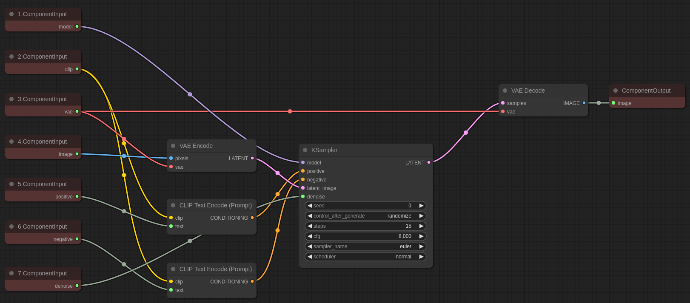
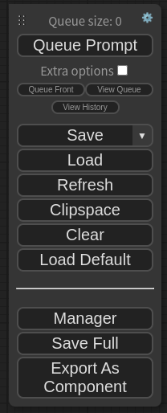
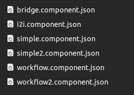
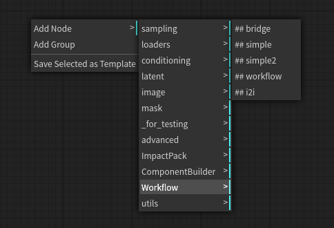
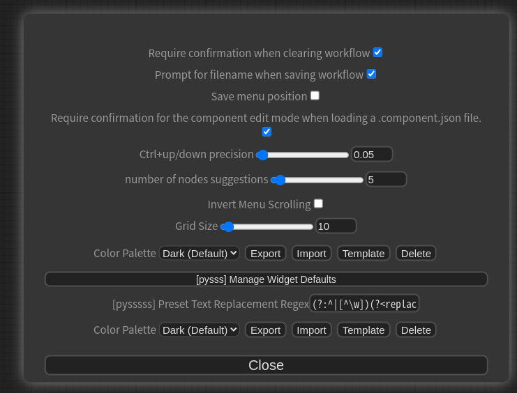
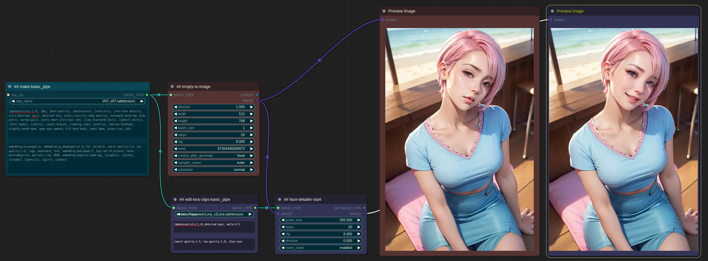

# ComfyUI-Workflow-Component
This is a side project to experiment with using workflows as components.
This extension, as an extension of the Proof of Concept, lacks many features, is unstable, and has many parts that do not function properly.
There is a high possibility that the existing components created may not be compatible during the update process.

## How To Build Component


* Through the ComponentBuilder under the ComponentInput node, specify the input interface of the component, and specify the output interface of the component through the ComponentOutput node.
* The slot name of the ComponentInput/Output node is used as the external interface name of the component.
* The order of the interface is determined by sorting the titles of the nodes in ascending order.



* Once all the component workflows have been created, you can save them through the "Export As Component" option in the menu. The file extension will be .component.json.

* **Note: Please make sure to avoid using the same name for input and output interface nodes in the component.**

## How To Use Component


* If you place the .components.json file, which is stored in the "components" subdirectory, and then restart ComfyUI, you will be able to add the corresponding component that starts with "##."



* When you load a .component.json file or load a workflow created with .component.json, the component is automatically loaded.


## How To Edit Component


* If the  ```Require confirmation for the component edit mode when loading a .component.json file.``` checkbox is unchecked, the .component.json file will always be loaded in the usage mode when loaded. To enable editing, please check the corresponding checkbox and click "OK" in the edit mode confirmation window to proceed.


## Example

* Once you install the Workflow Component and download this image, you can drag and drop it into comfyui. This will load the component and open the workflow.
* The component used in this example is composed of nodes from the [ComfyUI Impact Pack](https://github.com/ltdrdata/ComfyUI-Impact-Pack), so the installation of ComfyUI Impact Pack is required. If it is not installed, an error message will appear indicating that the node is missing. You can install it through the "missing nodes" installation menu in [ComfyUI-Manager](https://github.com/ltdrdata/ComfyUI-Manager).
 


# Requirements
* 

## Todo
- [x] Default interface name
- [x] Support of refresh combo (ex. ckpt, images, lora, ...)
- [x] Hot loading
- [x] used components must be included into workflow
  - [x] Save .json
  - [x] Load .json
  - [x] Save .png/.latent
  - [x] Load .png/.latent
- [x] Efficient traversal
- [x] Better internal error message
- [x] Report missing nodes in components when component is loaded
- [x] reroute problem fix
- [ ] Image Upload Widget
- [ ] Component nesting
- [ ] incomplete workflow checker
- [ ] unconnected output checker
- [ ] default value of component

## Credit

* ComfyUI/[ComfyUI](https://github.com/comfyanonymous/ComfyUI) - A powerful and modular stable diffusion GUI.
* pythongosssss/[ComfyUI-WD14-Tagger](https://github.com/pythongosssss/ComfyUI-WD14-Tagger) - A very cool badge-style progress came from here.