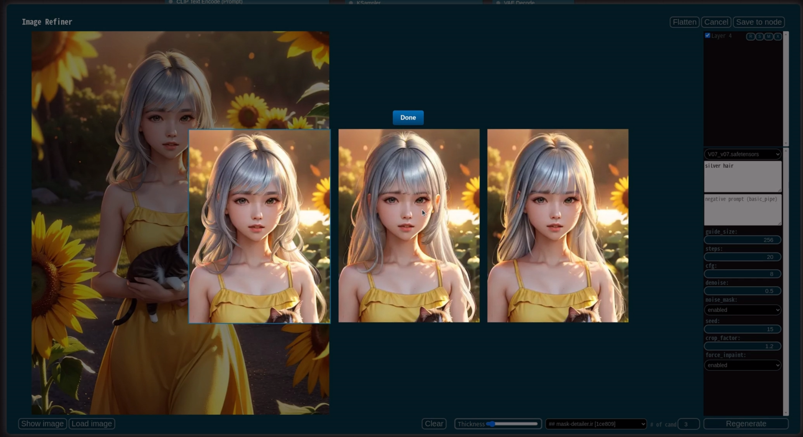

[](https://www.youtube.com/watch?v=7t-h4M4lsMU&list=PL_Ej2RDzjQLE2Ma9dX0G4OYLrrBve53UV)

# ComfyUI-Workflow-Component
This is a side project to experiment with using workflows as components.
This extension, as an extension of the Proof of Concept, lacks many features, is unstable, and has many parts that do not function properly.
There is a high possibility that the existing components created may not be compatible during the update process.

## Notice
* Some of the components provided by default are implemented using other custom nodes. To use those components, the custom nodes used within the component need to be available. If you are not using those specific components, you can safely ignore the warning as it will not affect other components.

## How To Build Component


* Through the ComponentBuilder under the ComponentInput node, specify the input interface of the component, and specify the output interface of the component through the ComponentOutput node.
* The slot name of the ComponentInput/Output node is used as the external interface name of the component.
* The order of the interface is determined by sorting the titles of the nodes in ascending order.


* Once all the component workflows have been created, you can save them through the "Export As Component" option in the menu. The file extension will be .component.json.
* After adding a Note and changing the title to "input-spec", you can set default values for specific input slots by following the format:

  **`input slot name`**:(default,**`value`**), (placeholder, **`text`**).

* For STRING inputs, you can use  to include a placeholder.

* **Note: Please make sure to avoid using the same name for input and output interface nodes in the component.**

## How To Use Component


* If you place the .components.json file, which is stored in the "components" subdirectory, and then restart ComfyUI, you will be able to add the corresponding component that starts with "##."


* When you load a .component.json file or load a workflow created with .component.json, the component is automatically loaded.
* This [tutorial video](https://www.youtube.com/watch?v=JE5B1jsBOvk) provides a detailed walkthrough of the process of creating a component.


## How To Edit Component


* If the  ```Require confirmation for the component edit mode when loading a .component.json file.``` checkbox is unchecked, the .component.json file will always be loaded in the usage mode when loaded. To enable editing, please check the corresponding checkbox and click "OK" in the edit mode confirmation window to proceed.

## Example

* Once you install the Workflow Component and download this image, you can drag and drop it into comfyui. This will load the component and open the workflow.
* The component used in this example is composed of nodes from the [ComfyUI Impact Pack](https://github.com/ltdrdata/ComfyUI-Impact-Pack), so the installation of ComfyUI Impact Pack is required. If it is not installed, an error message will appear indicating that the node is missing. You can install it through the "missing nodes" installation menu in [ComfyUI-Manager](https://github.com/ltdrdata/ComfyUI-Manager).
 


# Image Refiner


## How To Use
* Image Refiner is an interactive image enhancement tool that operates based on Workflow Components.
* There is an interface component in the bottom component combo box that accepts one image as input and outputs one image as output. If the input interface of the component has interfaces other than ```INT, FLOAT, STRING, COMBO, BASIC_PIPE, MODEL, VAE, CONDITIONING, LATENT, IMAGE```, it cannot be used.
  * However, currently, ```LATENT, CONDITIONING``` are not supported.
* Components that end with .ir are displayed above other components. Please save the component designed for Image Refiner as ***component_name*.ir.component.json**.
* When you press the "Generate" button, it will generate images by inpainting the masked areas based on the number specified in "# of cand." It will also add layers to the generated images.
  * [√]: If checked, the layer will be visible. If unchecked, the layer will be hidden.
  * R: Discard the current layer image and regenerate it with the same settings but with a changed seed for the specified number of candidates (# of cand).
  * S: Show a gallery dialog where you can view and switch between the generated candidate images for the current layer.
  * M: Load the mask used for generating the current layer.
  * X: Permanently delete the current layer.
* The base image for inpainting is the currently displayed image. If you uncheck and hide a layer, it will be excluded from the inpainting process.
* Flatten: Combines all the current layers into a base image, maintaining their current appearance.
* Show image: Opens a new tab with the current visible state as the resulting image.
* Load image: Discards the current work and performs a new operation with the loaded image.
  * This feature is useful when incorporating work done with external painting tools.
* Mask/Pen toggle:
  * When in Pen mode, the current drawing is added to the layer, and when in Mask mode, generation is performed using the current mask area.
* Control
  * Wheel: brush size adjustment
  * Left button-Drag: draw mask
  * Right button-Drag: erase mask
  * Ctrl-Wheel: Zoom adjustment
  * Ctrl-Drag: Pan
  * Enter: Regenerate
  * Esc: Close

# Tutorial video
* [Basic Usage](https://www.youtube.com/watch?v=waUv0R5wnac)
* [Handfix Workflow](https://www.youtube.com/watch?v=qbsU9zA8YQI)
* [Painting](https://youtu.be/ivi34PESgjU)
* [Import/Export](https://www.youtube.com/watch?v=MgNuMPGULls)

# Requirements
* -

## Todo
* Workflow Component
  - [x] Default interface name
  - [x] Support of refresh combo (ex. ckpt, images, lora, ...)
  - [x] Hot loading
  - [x] used components must be included into workflow
    - [x] Save .json
    - [x] Load .json
    - [x] Save .png/.latent
    - [x] Load .png/.latent
  - [x] Efficient traversal
  - [x] Better internal error message
  - [x] Report missing nodes in components when component is loaded
  - [x] reroute problem fix
  - [x] Resolve conflicts between components with the same name based on hash
  - [x] Set the currently configured ```widget value``` as the default value for component interface
  - [x] A feature that enables selecting a graceful termination for a specific execution path in a node instead of a crash
    - 'None' input is regarded as stop execute current execution path
  - [x] ExecutionSwitch node
  - [x] Unconnected output checker to avoid inefficient execution
  - [ ] ExecutionOneOf race condition issue
  - [ ] A feature that disable a specific optional input slot
    - [x] Handling the workflow execution of a node composed solely of optional inputs
  - [ ] Component nesting
  - [ ] Incomplete workflow checker
  - [ ] Provide random value executing inside component workflow.
  - [ ] Provide a validation checker when writing a component.
  - [ ] Provide a special input that can receive traces executed following a workflow.
* Image Refiner
  - [x] Layer flattening feature
  - [x] Simple painting feature
    - [x] Drawing layer
    - [x] Pass drawings to prompt
    - [x] Color palette
  - [ ] Cropped inpainting feature
  - [ ] Progress with preview
  - [ ] Support LATENT, CONDITIONING
  - [ ] Preset values for components
  - [ ] Mask editing feature for generated layer
  - [ ] Layer reodering
  - [ ] Improving the mask to make it less ugly

## Credit

* ComfyUI/[ComfyUI](https://github.com/comfyanonymous/ComfyUI) - A powerful and modular stable diffusion GUI.
* pythongosssss/[ComfyUI-WD14-Tagger](https://github.com/pythongosssss/ComfyUI-WD14-Tagger) - A very cool badge-style progress came from here.
